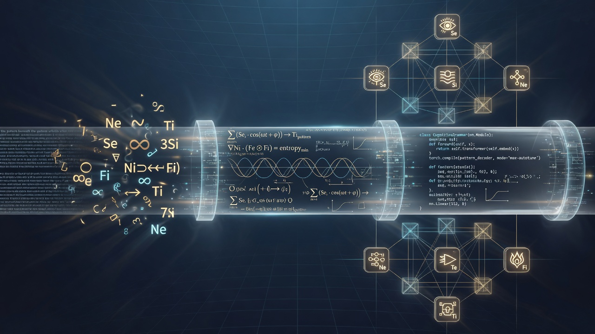

# Attention Algebra — A Cognitive Grammar for Language

> A formal grammar that lifts natural language into a higher-dimensional
> space of *functional constituents*, and compiles the result into
> executable reinforcement-learning agents.



---

## The Idea

Every sentence a person or a model produces is a *projection* of a
high-dimensional cognitive state down to a 1-D string of tokens. The
projection is lossy: two sentences that look nothing alike can be
driven by the same internal state, and a single sentence can be the
shadow of many overlapping states.

**Attention Algebra** is a *grammar* for the inverse projection. Given a piece
of natural language, it parses the string into an expression in a
small formal language whose terminals are the eight irreducible
*functional constituents* of cognition and whose operators describe
how those constituents interact. The expression is then compiled,
layer by layer, into a mathematical schedule and finally into a
PyTorch agent whose objective function is a direct image of the
original sentence.

In one sentence:

> *Attention Algebra is a type system and compiler for language, where the
> types are the eight Jungian functions and the compiled artefacts
> are reinforcement-learning policies whose loss landscapes are
> faithful encodings of the speaker's cognitive state.*

The pipeline is a strict functor from the category of strings under
"interpretation" to the category of differentiable programs under
"gradient descent":

```
  string  ───parse───▶  ⟨algebra⟩  ───compose───▶  ⟨schedule⟩  ───emit───▶  ⟨agent.py⟩
       (Layer 1)            (Layer 2)                       (Layer 3)
```

---

## Why a Grammar?

A grammar is the right abstraction for three reasons:

1. **Compositionality.** A grammar's production rules are *the same
   no matter how deep you nest*. A clause in a clause in a clause is
   parsed by the same rule that parses a clause. This is exactly the
   property we need: a sentence can have arbitrarily many layers of
   motivation, conflict, and rationalisation, and we want a single
   parser to handle all of them.
2. **Type safety.** Each terminal of the grammar is tagged with its
   *domain* (Perception vs. Judgment) and its *attitude*
   (Extraverted vs. Introverted). The operators (`~`, `oo`, `→`, `|`,
   `+`) are partial functions that are only well-typed on certain
   combinations. The parser will reject `Se ~ Si` (same domain,
   different attitude — not a legal orbit) and accept `(Ne ~ Ti)`.
3. **Realisability.** Every well-typed expression has a *canonical
   mathematical image*: a sum of weighted objective functions whose
   scheduling dynamics follow directly from the operator. The compiler
   in Layer 3 is total: every parseable expression compiles.

The grammar is tiny — eight terminals, five operators, two numeric
attributes — but it spans the cognitive space densely because the
operators let you weave the terminals into molecules of arbitrary
complexity.

---

## The Grammar

### Terminals — the eight functional constituents

| Symbol | Name                    | Domain     | Attitude      |
| :----: | :---------------------- | :--------- | :------------ |
|  `Se`  | Extraverted Sensing     | Perception | Extraverted   |
|  `Si`  | Introverted Sensing     | Perception | Introverted   |
|  `Ne`  | Extraverted Intuition   | Perception | Extraverted   |
|  `Ni`  | Introverted Intuition   | Perception | Introverted   |
|  `Te`  | Extraverted Thinking    | Judgment   | Extraverted   |
|  `Ti`  | Introverted Thinking    | Judgment   | Introverted   |
|  `Fe`  | Extraverted Feeling     | Judgment   | Extraverted   |
|  `Fi`  | Introverted Feeling     | Judgment   | Introverted   |

The terminals are the *functional constituents* of the title: a
minimal, complete, and orthogonal basis for the cognitive space. No
terminal can be expressed as a combination of the others.

### Numeric attributes

Every terminal may be preceded by a bare integer that names its
**mass** (intensity, 1–10), e.g. `7Se`. A parenthesised group may
itself be preceded by a bare integer that names its **acceleration**
(frequency, any positive real), e.g. `40(Ti)`.

```
mass       ::=  [1-9][0-9]?    attached to a terminal
accel      ::=  [1-9][0-9]*    attached to a parenthesised expression
```

### Operators — the production rules

| Symbol | Name        | Semantics                                                                                | Schedule logic           |
| :----: | :---------- | :--------------------------------------------------------------------------------------- | :----------------------- |
| `~`    | Orbit       | A Judgement unit (T/F) wraps a Perception unit (S/N) and structures it.                 | Orbital (sin/cos mod.)   |
| `oo`   | Opposition  | Two same-domain, opposite-attitude functions clash; the winner drags to the opposite domain. | Adversarial              |
| `→`    | Drag        | The right-hand side of an Opposition: a single function, not a group.                    | Drag (exponential)       |
| `\|`   | Switching   | Alternation between two *cross-domain* functions over time.                              | Stochastic switching     |
| `+`    | Conjunction | Linear sum of independent functions.                                                     | Linear                   |
| `( )`  | Grouping    | Override precedence, nest molecules.                                                     | —                        |

### Well-typedness

* `~` requires one Perception terminal on the left and one Judgment
  terminal on the right (or vice versa). Two Perceptions or two
  Judgments cannot orbit.
* `oo` requires two terminals of the *same domain* and *opposite
  attitude*. It always emits a `→` whose right-hand side flips the
  domain (S↔N, T↔F) while preserving the winner's attitude.
* `→` is *not* free-standing; it only appears as the right-hand side
  of an `oo`.
* `|` requires two terminals of *different domains*. Same-domain
  alternation collapses to a single function.

A full BNF lives in [`attention_algebra/algebra.py`](attention_algebra/algebra.py); the
LLM analyst is given the rules and asked to emit parseable strings.

### Worked examples

| Natural language                                                              | Parse                                             |
| :----------------------------------------------------------------------------- | :------------------------------------------------ |
| "A slow, heavy realisation."                                                  | `5(Ni)`                                            |
| "Racing thoughts over and over."                                              | `50(Ti)`                                           |
| "Exploring ideas to build a system."                                          | `(Ne ~ Ti)`                                        |
| "I explore impulsively but feel held back by past regrets."                    | `7Se oo 3Si -> Ni`                                 |
| "A deep internal value conflict slowly forces me to organise my environment." | `10((Fi oo Fe) -> Te) ~ Si`                        |
| "A million racing possibilities tethered to social harmony."                  | `100(Ne ~ Fe)`                                     |

---

## The Functional Space

The eight terminals are not just labels. Each one names a direction in
a four-dimensional functional space, and the cognitive state of an
agent is a *vector* in that space. The grammar is the surface syntax
of that vector algebra:

| Dimension         | Axis 0     | Axis 1     | Basis elements       |
| :---------------- | :--------- | :--------- | :------------------- |
| **Domain**        | Perception | Judgment   | `S`/`N` vs. `T`/`F`  |
| **Attitude**      | Introvert  | Extravert  | `i` vs. `e` suffix   |
| **Mass**          | —          | —          | bare integer prefix  |
| **Acceleration**  | —          | —          | integer group prefix |

The four dimensions are independent, so the space is ℝ⁸ with two
auxiliary real axes for mass and acceleration per terminal. A sentence
like

> "I am torn between the part of me that wants to explore and the
> part that wants to hold on to the familiar, but the pull toward
> harmony keeps dragging me back."

parses to a single point in that space; a paragraph parses to a
*trajectory*; a conversation parses to a *flow*. The Attention Algebra
compiler is a differentiable readout of that flow.

---

## Model Providers

All three layers call an LLM through the **OpenAI SDK** (via
`langchain-openai`).  Two OpenAI-compatible backends are supported:

| Provider | When to use | Required config |
| :------- | :---------- | :-------------- |
| **OpenRouter** | Cloud models (Gemini, Claude, Qwen, Llama, …) | `OPENROUTER_API_KEY` |
| **llama.cpp** | Local inference with `llama-server` | `LLAMA_CPP_BASE_URL`, `LLAMA_CPP_MODEL` |

Pass `provider="openrouter"` or `provider="llama.cpp"` to each layer
class.  The Gradio UI exposes the same choice as a radio button.

---

## The Three Layers

The grammar is realised by a strict, three-stage compiler. Each layer
is a pure function of the previous layer's output, and the layers
themselves are language-model calls constrained by an explicit
production rule. You can swap any layer for your own implementation as
long as it respects the input/output contract.

### Layer 1 — The Algebraic Analyst (`attention_algebra.algebra`)

* **Input:** natural language.
* **Process:** an LLM, prompted with the grammar reference, produces
  a single parse tree flattened to a string.
* **Output:** a *type-checked* expression in the grammar.

```python
from attention_algebra import AlgebraAnalyst
analyst = AlgebraAnalyst(
    model_name="google/gemini-2.5-flash",
    provider="openrouter",
)
expr = analyst.analyze("I am torn between exploration and holding on.")
# '7Ne oo 3Si -> Fe'
```

### Layer 2 — The Harmonic Composer (`attention_algebra.composition`)

* **Input:** a grammar expression.
* **Process:** an LLM, prompted with the function-to-objective table
  below, emits a JSON *Mathematical Schedule* describing the loss
  landscape.
* **Output:** a JSON object with `schedule_logic`, `score`, and
  `math_narrative`.

The canonical mapping from terminal to optimisation objective:

| Terminal | Objective class        | Math (LaTeX)                       | Interpretation                       |
| :------: | :--------------------- | :--------------------------------- | :----------------------------------- |
| `Se`     | `ExplorationObjective` | $\mathcal{H}(\pi(a\mid s))$         | Maximise policy entropy.             |
| `Si`     | `GatheringObjective`   | $e^{-\lVert s-\mu\rVert}$            | Cluster around the centroid.         |
| `Ne`     | `ExtrapolationObjective` | $e^{\lVert s-\mu\rVert}$           | Seek novel states.                   |
| `Ni`     | `InterpolationObjective` | $\text{proj}_{\vec v}(s)$          | Follow an imagined trajectory.       |
| `Te`     | `ExploitationObjective` | $\mathbb{E}[V(s)]$                  | Maximise value.                      |
| `Ti`     | `ContrastObjective`    | $\lvert d(s,a)-d(s,b)\rvert$         | Maximise discrimination.             |
| `Fe`     | `IntegrationObjective` | $\mathcal{H} + \alpha V(s)$         | Balance exploration and value.       |
| `Fi`     | `SelectionObjective`   | $e^{-d(s, s_{t-1})}$                | Stay consistent with the past.       |

```python
from attention_algebra import Composer
composer = Composer(
    model_name="google/gemini-2.5-flash",
    provider="openrouter",
)
schedule = composer.compose("7Ne oo 3Si -> Fe")
# {'schedule_logic': 'Adversarial',
#  'global_frequency': 1.0,
#  'score': [{'voice': '...', 'symbol': 'ExtrapolationObjective', ...}, ...],
#  'math_narrative': '...'}
```

### Layer 3 — The Mechanic (`attention_algebra.code`)

* **Input:** the Mathematical Schedule.
* **Process:** an LLM emits a stand-alone Python file deriving from
  `capo.PPOAgent`, with the per-step weight dynamics
  (`sin`/`cos` for Orbital, `exp(-λt)` for Drag, etc.) implemented in
  `get_action`.
* **Output:** a string of executable Python that you can save and run.

The compiled code preserves every coefficient from the original
expression, so the agent's loss landscape is bit-for-bit the same
shape as the speaker's cognitive state.

---

## Installation

### Prerequisites

* Python 3.10 or newer
* An LLM backend — pick one:
  * **[OpenRouter](https://openrouter.ai/)** — easiest path; one API key
    gives access to Gemini, Claude, Qwen, Llama, and other models.
  * **[llama.cpp](https://github.com/ggerganov/llama.cpp) server** — run
    models locally via the OpenAI-compatible endpoint:

    ```bash
    llama-server -m model.gguf --port 8080
    ```

### Install

```bash
git clone https://github.com/iblameandrew/attention-algebra.git
cd attention-algebra
pip install -r requirements.txt
```

### Configure

Create a `.env` file in the project root (or export the variables in
your shell):

```bash
# OpenRouter (cloud)
echo 'OPENROUTER_API_KEY=your_api_key_here' > .env

# llama.cpp server (local) — optional overrides
# LLAMA_CPP_BASE_URL=http://127.0.0.1:8080/v1
# LLAMA_CPP_MODEL=local
# LLAMA_CPP_API_KEY=no-key
```

---

## Usage

### Interactive UI

```bash
python app.py
```

This launches a three-pane Gradio interface. Type a sentence in
*Context*, choose **OpenRouter** or **llama.cpp (Local)**, pick a model,
click *Analyze*, and watch the algebra, the math schedule, and the
agent code appear in order.

### Programmatic

```python
import os
from attention_algebra import AlgebraAnalyst, Composer, CodeGenerator

os.environ.setdefault("OPENROUTER_API_KEY", "...")
model = "google/gemini-2.5-flash"

# Layer 1: parse.
algebra = AlgebraAnalyst(model_name=model, provider="openrouter").analyze(
    "I explore impulsively but feel held back by past regrets."
)

# Layer 2: compose.
schedule = Composer(model_name=model, provider="openrouter").compose(algebra)

# Layer 3: emit code.
agent_src = CodeGenerator(model_name=model, provider="openrouter").generate_code(
    schedule
)
with open("algebra_agent.py", "w") as f:
    f.write(agent_src)
```

### Local llama.cpp

```python
import os

os.environ["LLAMA_CPP_BASE_URL"] = "http://127.0.0.1:8080/v1"
os.environ["LLAMA_CPP_MODEL"] = "local"  # must match the loaded model

algebra = AlgebraAnalyst(model_name="local", provider="llama.cpp").analyze(
    "Racing thoughts over and over."
)
```

---

## Repository Layout

```
attention-algebra/
├── assets/                # README banner image
├── app.py                 # Gradio front-end
├── attention_algebra/
│   ├── algebra.py         # Layer 1 — the grammar + the analyst
│   ├── composition.py     # Layer 2 — the harmonic composer
│   ├── code.py            # Layer 3 — the agent code generator
│   ├── config.py          # Model factory (OpenRouter / llama.cpp)
│   ├── utils.py           # strip_think_tags, strip_code_fences
│   └── __init__.py
├── requirements.txt
└── README.md
```

---

## Roadmap to AGI

We use the grammar as an *evaluation instrument*. A model that can
parse into, reason over, and emit from all eight terminals in all
five operator configurations is by construction manipulating the
same functional constituents a human does. Coupled with a target
distribution over parse trees (derived empirically from a corpus of
human reasoning traces), the grammar lets us define a *cognitive
completeness* criterion for AGI that is independent of any particular
benchmark: a model is generally intelligent iff its distribution
over grammar expressions matches the human distribution under KL
divergence below a threshold.

In the meantime, Attention Algebra is a tool for *diagnosing* what a model is
doing. Drop a chain-of-thought trace in, get the grammar expression
out, and read the cognitive state of the model the way a spectrogram
reads a sound.

---

## License

MIT. See [`LICENSE`](LICENSE).
